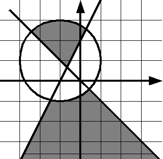

Проверьте, принадлежит ли точка данной закрашенной области:

Если точка принадлежит области (область включает границы), выведите слово YES, иначе выведите слово NO.

Решение должно содержать функцию IsPointInArea(x, y), возвращающую True, если точка принадлежит области и False, если не принадлежит. Основная программа должна считать координаты точки, вызвать функцию IsPointInArea и в зависимости от возвращенного значения вывести на экран необходимое сообщение.

Функция IsPointInArea не должна содержать инструкцию if.

Формат входных данных  
Вводятся два действительных числа.

Формат выходных данных  
Выведите ответ на задачу.

Sample Input 1:  
-4  
-4

Sample Output 1:  
NO

Sample Input 2:  
-4  
-3

Sample Output 2:
NO
